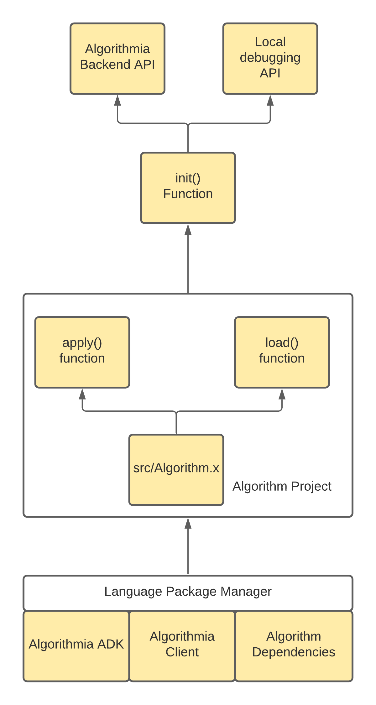

# Algorithm Development Kit (ADK), Python edition

<!-- embedme examples/hello_world/src/Algorithm.py -->
```python
```
## Focus
This document will describe the following:
- What is an Algorithm Development Kit
- Changes to Algorithm development
- Example workflows you can use to create your own Algorithms.
- The Model Manifest System
- Datarobot MLOps integrations support


## What is an Algorithm Development Kit
An Algorithm Development Kit is a package that contains all of the necessary components to convert a regular application into one that can be executed and run on Algorithmia.
To do that, an ADK must be able to communicate with [langserver](https://github.com/algorithmiaio/langpacks/blob/develop/langpack_guide.md).
To keep things simple, an ADK exposes some optional functions, along with an `apply` function that acts as the explicit entrypoint into your algorithm.
Along with those basics, the ADK also exposes the ability to execute your algorithm locally, without `langserver`; which enables better debuggability.



This kit, when implemented by an algorithm developer - enables an easy way to get started with your project, along with well defined hooks to integrate with an existing project.


## Changes to Algorithm Development

Algorithm development does change with this introduction:
- Primary development file has been renamed to `src/Algorithm.py` to aide in understanding around what this file actually does / why it's important
- An additional import (`from algorithm import ADK`)
- An optional `load()` function that can be implemented
    - This enables a dedicated function for preparing your algorithm for runtime operations, such as model loading, configuration, etc
- A call to the handler function with your `apply` and optional` load` functions as inputs
    - ```python
      algorithm = ADK(apply)
      algorithm.init("Algorithmia")
      ```
    - Converts the project into an executable, rather than a library
      - Which will interact with the `langserver` service on Algorithmia
      - But is debuggable via stdin/stdout when executed locally / outside of an Algorithm container
        - When a payload is provided to `init()`, that payload will be directly provided to your algorithm when executed locally, bypassing stdin parsing and simplifying debugging!
      - This includes being able to step through your algorithm code in your IDE of choice! Just execute your `src/Algorithm.py` script and try stepping through your code with your favorite IDE

## Example workflows
Check out these examples to help you get started:
### [hello world example](examples/hello_world)
  <!-- embedme examples/hello_world/src/Algorithm.py -->
```python
```

### [hello world example with loaded state](examples/loaded_state_hello_world)
<!-- embedme examples/loaded_state_hello_world/src/Algorithm.py -->
```python
```
## [pytorch based image classification](examples/pytorch_image_classification)
<!-- embedme examples/pytorch_image_classification/src/Algorithm.py -->
```python
```

## The Model Manifest System
Model Manifests are optional files that you can provide to your algorithm to easily
define important model files, their locations; and metadata - this file is called `model_manifest.json`.
<!-- embedme examples/pytorch_image_classification/model_manifest.json -->
```python
```
With the Model Manifest system, you're also able to "freeze" your model_manifest.json, creating a model_manifest.json.freeze.
This file encodes the hash of the model file, preventing tampering once frozen - forver locking a version of your algorithm code with your model file.
<!-- embedme examples/pytorch_image_classification/model_manifest.json.freeze -->
```python
```

As you can link to both hosted data collections, and AWS/GCP/Azure based block storage media, you're able to link your algorithm code with your model files, wherever they live today.


## Datarobot MLOps Integration
As part of the integration with Datarobot, we've built out integration support for the [DataRobot MLOps Agent](https://docs.datarobot.com/en/docs/mlops/deployment/mlops-agent/index.html)
By selecting `mlops=True` as part of the ADK `init()` function, the ADK will configure and setup the MLOps Agent to support writing content directly back to DataRobot.


For this, you'll need to select an MLOps Enabled Environment; and you will need to setup a DataRobot External Deployment.
Once setup, you will need to define your `mlops.json` file, including your deployment and model ids.

<!-- embedme examples/mlops_hello_world/mlops.json -->
```python
```

Along with defining your `DATAROBOT_MLOPS_API_TOKEN` as a secret to your Algorithm, you're ready to start sending MLOps data back to DataRobot!

<!-- embedme examples/mlops_hello_world/src/Algorithm.py -->
```python
```

report_deployment_stats()


## Readme publishing
To compile the template readme, please check out [embedme](https://github.com/zakhenry/embedme) utility
and run the following:
```commandline
npm install -g npx
npx embedme --stdout README_template.md > README.md
```

## To publish a new version 
Publishing should be automatic on new releases, but if you wish to publish manually this is the process
first make sure to update the version in [setup.py](setup.py)
Then go through the following
Then, install these python dependencies
```commandline
pip install wheel==0.33
pip install setuptools==41.6
pip install twine==1.15
```

Setup your ~/.pypirc file:
```commandline
index-servers =
  pypi
  pypitest

[pypi]
repository: https://upload.pypi.org/legacy/
username: algorithmia
password: {{...}}

[pypitest]
repository: https://test.pypi.org/legacy/
username: algorithmia
password: {{...}}
```
The passwords (and the pypirc file itself) can be found in our devtools service
Make sure to update your setup.py with the new version before compiling.
Also make sure that this is created on Linux and not any other platform.
Compile via setup.py:
```commandline
python setup.py sdist bdist_wheel --universal
python -m twine upload -r pypitest dist/*

```
Verify that it works on pytest, then:
```commandline
python -m twine upload -r pypi dist/*
```
and you're done :)